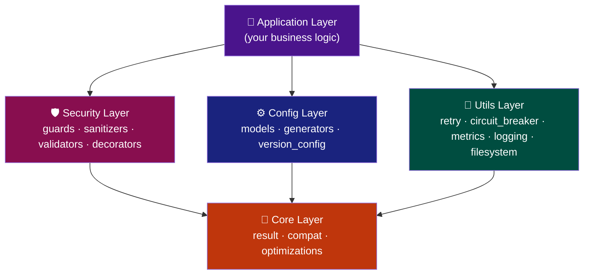

# TaipanStack Architecture

TaipanStack is built on the philosophy of **maximum safety by default**, combined with blazing-fast asynchronous programming. The internal architecture enforces a strict layered dependency map, statically verified on every commit.

## Layered Dependency Model

The architecture enforces unidirectional data flow. Upper layers may import from lower layers; lower layers may **never** import upward.



### Dependency Contracts (Import Linter)

These contracts are **enforced statically in CI** via [Import Linter](https://github.com/seddonym/import-linter). Any violation fails the build immediately.

| Contract | Rule |
|----------|------|
| `core` is independent | `taipanstack.core` cannot import from `security`, `utils`, or `config` |
| `security` is independent | `taipanstack.security` cannot import from `utils` or `config` |
| `utils` is independent | `taipanstack.utils` cannot import from `security` or `config` |
| `config` only uses `core` | `taipanstack.config` cannot import from `security` or `utils` |

---

## Project Structure

```text
TaipanStack/
├── src/
│   └── taipanstack/
│       ├── __init__.py       # Public API surface
│       ├── core/             # 🎯 Result types, compat, optimizations
│       │   ├── result.py     #    Ok / Err / safe / unwrap_or
│       │   ├── compat.py     #    Python version feature flags
│       │   └── optimizations.py # uvloop / orjson bootstrap
│       ├── config/           # ⚙️ Configuration models & generators
│       │   ├── models.py     #    StackConfig (Pydantic v2)
│       │   ├── generators.py #    Project scaffolding templates
│       │   └── version_config.py # Version-aware recommendations
│       ├── security/         # 🛡️ Guards, sanitizers, validators
│       │   ├── guards.py     #    Path traversal, command injection, env guards
│       │   ├── sanitizers.py #    XSS, filename, SQL, env value sanitization
│       │   ├── validators.py #    Email, URL, project name, Python version
│       │   └── decorators.py #    @safe_path, @safe_env wrappers
│       └── utils/            # 🔧 Resilience & observability utilities
│           ├── circuit_breaker.py # Circuit breaker with on_state_change callback
│           ├── retry.py           # Exponential backoff with on_retry callback
│           ├── metrics.py         # @timed, @counted decorators
│           ├── logging.py         # Structured logging (structlog)
│           ├── filesystem.py      # Safe file operations
│           └── subprocess.py      # Sandboxed subprocess execution
├── tests/                    # ✅ 683 tests, 100% coverage
│   ├── test_benchmarks.py    # pytest-benchmark performance suite
│   ├── test_property_sanitizers.py # Hypothesis fuzzing
│   └── test_v031_features.py # v0.3.1 specific new behaviors
├── docs/                     # 📖 MkDocs Material documentation
├── .semgrep/                 # 🔍 Custom SAST rules
├── .github/                  # 🔄 CI/CD + SBOM/SLSA + Docs workflows
├── Dockerfile                # 🐳 Hardened multi-stage container
└── pyproject.toml            # 📋 Modern dependency management (Poetry)
```

---

## Concurrency Model

When production dependencies are installed (`uvloop` group), TaipanStack bootstraps `uvloop` as the asyncio event loop, providing a **2–4× throughput improvement** over the standard `asyncio` loop on Linux/macOS.

```python
from taipanstack.core.optimizations import apply_optimizations

apply_optimizations()  # Auto-installs uvloop + orjson if available
```

Python version detection is performed at import time via `taipanstack.core.compat`:

```python
from taipanstack import PY313, get_features

if PY313:
    print(get_features())  # Reports 3.13-specific optimizations
```

---

## Error Handling Philosophy

Exceptions represent **unrecoverable panics**. For standard, expected failures (network errors, validation failures, missing data), TaipanStack uses the `Result` monad:

!!! success "Rule: Never raise to communicate a business failure"
    ```python
    # ❌ DO NOT: leaks exception semantics into caller
    def find_user(user_id: str) -> User:
        raise UserNotFoundError(...)

    # ✅ DO: encode failure in the return type
    def find_user(user_id: str) -> Result[User, UserNotFoundError]:
        return Err(UserNotFoundError(user_id))
    ```

**Benefits enforced by Mypy strict:**

- You **cannot forget** to handle an `Err` — the type checker forces it
- Pattern matching (`match`/`case`) gives exhaustive, safe unpacking
- The `@safe` decorator wraps any raising function into a `Result` automatically

---

## Security Strategy

TaipanStack's security layer is **fail-closed by design**:

| Principle | Implementation |
|-----------|----------------|
| **No silent failures** | Malformed input raises `SecurityError` or `TypeError` immediately |
| **Boundary validation** | All external data validated at entry via `pydantic` + guards |
| **Runtime type guards** | Every public security function validates input types at v0.3.1+ |
| **AST scanning** | Bandit + Semgrep (custom rules) runs on every CI push |
| **Supply chain** | SBOM (CycloneDX via Syft) + SLSA attestation (Cosign/Sigstore) on every release |
