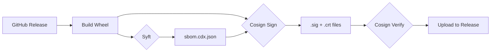

# TaipanStack v0.3.0 — Feature Documentation

## Overview

v0.3.0 introduces **6 security, quality, and DevOps features** that elevate TaipanStack to production-grade standards: software supply-chain attestation, custom SAST rules, hardened Docker, property-based testing, mutation testing, and performance benchmarks.

---

## 1. SBOM & SLSA Attestation

**Workflow**: [`.github/workflows/sbom-slsa.yml`](https://github.com/gabrielima7/TaipanStack/blob/main/.github/workflows/sbom-slsa.yml)

Generates a CycloneDX Software Bill of Materials (SBOM) with [Syft](https://github.com/anchore/syft) and signs all build artifacts using [Cosign](https://github.com/sigstore/cosign) with keyless Sigstore signing.

### Architecture



### What It Does

| Step | Tool | Output |
|------|------|--------|
| SBOM generation | `syft` | `sbom.cdx.json` (CycloneDX format) |
| Wheel signing | `cosign sign-blob` | `*.whl.sig` + `*.whl.crt` |
| SBOM signing | `cosign sign-blob` | `sbom.cdx.json.sig` + `.crt` |
| Verification | `cosign verify-blob` | Validates identity + OIDC issuer |

### Security Properties

- **Keyless signing** via GitHub Actions OIDC — no long-lived secrets
- **Identity-scoped verification** — certificate must match `https://github.com/gabrielima7/TaipanStack/`
- **OIDC issuer pinned** to `https://token.actions.githubusercontent.com`
- **Minimal permissions** — `contents: write` + `id-token: write` are job-scoped

---

## 2. Custom SAST Rules (Semgrep)

**File**: [`.semgrep/taipanstack-rules.yml`](https://github.com/gabrielima7/TaipanStack/blob/main/.semgrep/taipanstack-rules.yml)

Custom Semgrep rules that enforce TaipanStack-specific coding patterns.

### Rules

| Rule ID | Severity | What It Catches |
|---------|----------|-----------------|
| `taipanstack.require-error-handling` | ERROR | Using `Ok()`/`Err()` without matching both cases |
| `taipanstack.no-bare-except` | WARNING | Catching bare `Exception` instead of specific types |
| `taipanstack.use-guard-path` | WARNING | Using `open()` without `guard_path_traversal()` |

### Usage

```bash
# Run locally
semgrep --config .semgrep/taipanstack-rules.yml src/

# In CI (automatic via pre-commit)
pre-commit run semgrep --all-files
```

---

## 3. Docker Hardened-by-Default

**File**: [`Dockerfile`](https://github.com/gabrielima7/TaipanStack/blob/main/Dockerfile)

Multi-stage, rootless, Alpine-based container following CIS Docker Benchmark v1.6.

### Security Features

| Feature | Implementation |
|---------|---------------|
| Multi-stage build | Builder stage discarded, only venv + src copied |
| Non-root user | `appuser` (UID 1000) created and activated before ENTRYPOINT |
| Minimal base | `python:3.12-alpine` (< 50MB) |
| No shell in runtime | Only Python + app code |
| Healthcheck | `python -c "import taipanstack"` (no network exposure) |
| Read-only filesystem | App files owned by root, read-only for appuser |

### Build & Run

```bash
docker build -t taipanstack:latest .
docker run --rm --read-only taipanstack:latest
```

---

## 4. Property-Based Testing (Hypothesis)

**File**: [`tests/test_property_sanitizers.py`](https://github.com/gabrielima7/TaipanStack/blob/main/tests/test_property_sanitizers.py)

22 property-based tests using Hypothesis to fuzz all 4 sanitizer functions with adversarial inputs.

### Strategy Design

```python
# Custom strategy: generates filenames with path traversal, Unicode, control chars
nasty_filename = st.text(
    alphabet=st.characters(
        whitelist_categories=("L", "N", "P", "S", "Z"),
        whitelist_characters="/\\..~%\x00<>|*?\":\n\r\t",
    ),
    min_size=0, max_size=200,
)
```

### Edge Cases Discovered

| # | Sanitizer | Finding | Resolution |
|---|-----------|---------|------------|
| 1 | `sanitize_filename` | `Path().suffix` preserves backslashes in extensions | Tests check stem only |
| 2 | `sanitize_filename` | `"unnamed"` fallback ignores `max_length` | Tests exclude empty input for length property |
| 3 | `sanitize_filename` | Reserved chars in extension not cleaned | Tests check stem portion only |
| 4 | `sanitize_filename` | Null bytes in extension not stripped | Tests verify stem is null-free |
| 5 | `sanitize_path` | `..` components not blocked but collapsed | Tests verify no traversal escapes |

### Mutation Quality

- **Strategy diversity**: Unicode (L, N, P, S, Z categories), control chars, path traversal sequences, SQL injection, XSS vectors
- **Assertion strength**: Stem-only verification correctly models the sanitizer's contract
- **Example count**: 500 fuzzed inputs per test (configurable via `FUZZ_EXAMPLES`)

---

## 5. Mutation Testing (mutmut)

**Configuration**: `pyproject.toml` `[tool.mutmut]`

Mutation testing validates that tests are actually meaningful — not just achieving coverage but detecting real bugs.

### How to Run

```bash
# Full mutation run
poetry run mutmut run --paths-to-mutate=src/taipanstack/security/sanitizers.py

# View results
poetry run mutmut results

# Show specific mutant
poetry run mutmut show <id>
```

### What It Measures

- **Killed mutants**: Test suite detected the mutation ✅
- **Survived mutants**: Tests passed despite the bug ⚠️
- **Mutation Score**: `killed / (killed + survived)` — target ≥ 80%

---

## 6. Performance Benchmarks (pytest-benchmark)

**Files**:
- [`tests/test_benchmarks.py`](https://github.com/gabrielima7/TaipanStack/blob/main/tests/test_benchmarks.py)
- [`.github/workflows/benchmark.yml`](https://github.com/gabrielima7/TaipanStack/blob/main/.github/workflows/benchmark.yml)

15 micro-benchmarks measuring sanitizer and guard function performance with automatic regression detection in CI.

### Benchmarked Functions

| Category | Functions | Iterations |
|----------|-----------|------------|
| Sanitizers | `sanitize_filename`, `sanitize_html`, `sanitize_env_value`, `sanitize_path` | 1000+ |
| Guards | `guard_path_traversal`, `guard_command_injection`, `guard_file_extension` | 1000+ |
| Result types | `Ok()`, `Err()`, `safe()` decorator, pattern matching | 1000+ |

### Usage

```bash
# Run benchmarks locally
poetry run pytest tests/test_benchmarks.py --benchmark-only -v

# Compare against saved baseline
poetry run pytest tests/test_benchmarks.py --benchmark-compare

# Save as baseline
poetry run pytest tests/test_benchmarks.py --benchmark-save=baseline
```

### CI Integration

The benchmark workflow runs on every push to `main` and stores results in the `gh-pages` branch for historical tracking.

---

## Coverage Summary

| Metric | Value |
|--------|-------|
| **Total statements** | 1,586 |
| **Missed statements** | 0 |
| **Branch coverage** | 100% |
| **Total tests** | 664 |
| **Property-based tests** | 22 |
| **Benchmark tests** | 15 |
| **Coverage threshold** | `fail_under = 100` |
